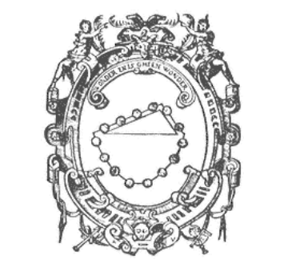
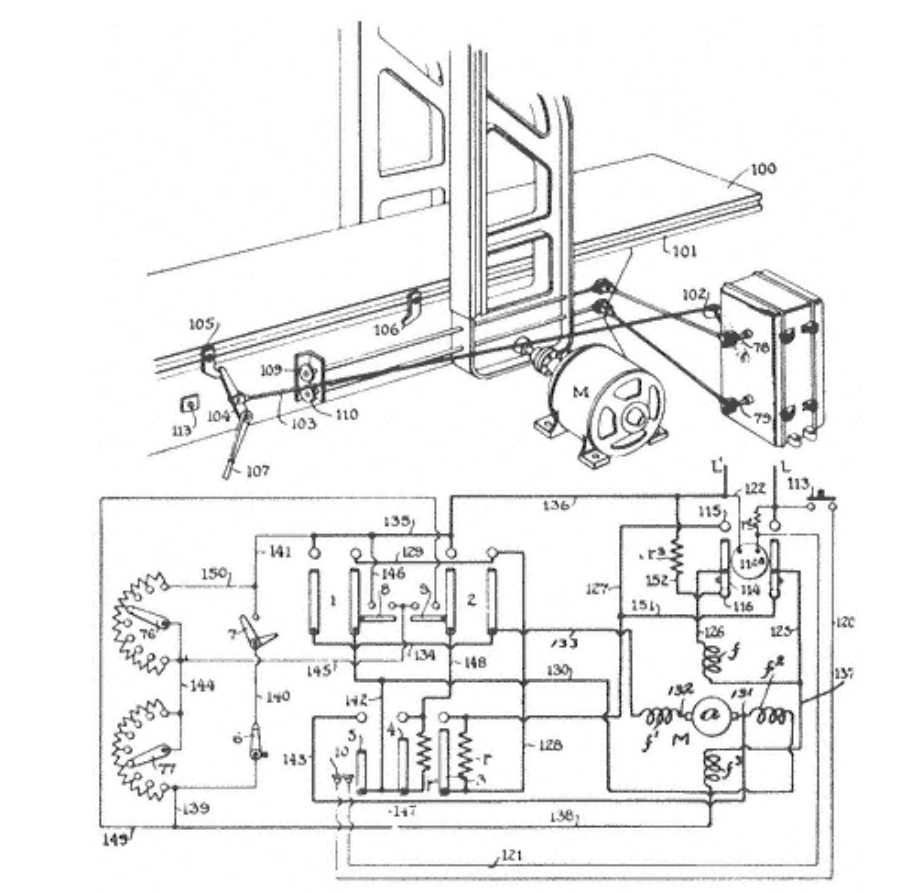

# 1 理解自然和人工的世界

牛顿时代三百年后的今天，我们已经熟知了自然科学的概念，物理学和生物学便是其中代表。自然科学是关于某一种事物或现象的知识，主要表现在这类事物的特征，性质，以及互相之间的关联与作用上。

自然科学的核心目标是将奇妙的事物变得寻常，化繁为简，从混乱中寻得规律。德国早期物理学家Simon Stevin用一个简洁优雅的图画阐明了斜面定律。图中的小球，根据经验和永动机的不可能性，既不可能向左滚动，也不可能向右 -- 保持静止是唯一的可能性。（当然，如果小球一开始就是移动的话，那它会保持永动，但这并不改变什么。）由于垂落的部分是对称的，我们可以在保持原有平衡的情况下把它去掉。现在长缓面上的球平衡了短陡面上的，它们的数量（质量）和斜面角度的正弦成反比。

Stevin对这个构造爱不释手，所以把它放到了一张插图里，并写上：

> _Wonder, en is gheen wonder_

意指：“奇妙，但并非不可理解。”

这就是自然科学的任务 -- 让奇妙的事物变得可以理解，并保留其奇妙的本质。当我们寻得奇妙事物中的内在规律时，一种新的奇妙便诞生了：复杂的事物是由简单的事物编织而成的。由此可见，数学和自然科学的美与音乐和绘画的美是相通的 -- 两者的美都在于发现某种半隐半现的内在规律。

和以前的自然世界相比，我们现今所生活的世界比以往要更加的“人工制造 \(man-made$$^1$$\)”，几乎所有元素都有人工设计的印记 -- 我们大部分时间生活在20摄氏度恒温的室内，湿度根据情况被调控，而且空气中大部分的杂质都是人为产生（和过滤）的。


1. 我会偶尔把“man”当做雌雄同体的名词来使用，包含所有性别。同样的，“he”,"his"和“him”将被如此使用。


不仅如此，对于大部分的白领工作者来说，环境的很大一部分是由一种连成串的”符号"构成的。我们通过文字和语言将这些符号从耳朵和眼睛接收，也通过嘴和手把它们向环境输出。这些符号所遵守的定律，有关它们的输入和输出的规律，以及它们被指定代表的事物，都是由人类共同创造产生的结果。

有人或许觉得我夸大了人工对世界的影响。作为生物，人必须遵守物理和生物的定律。我承认确实有些夸大，但也没有很多。宇航员和飞行员也是遵照物理定律的，但这样的“遵照”并没有很直接的表现。亚里士多德认为重物上浮和轻物下沉是不自然的（物理，卷4）；但是显然我们对自然规律的理解比他更深刻。

所以，当我们试图把“生物的”等同于“自然的”的时候，一定要小心。一片森林或许是个自然现象，但是一片农场肯定不是。各类食物来源 -- 玉米，牲畜等，都含有我们原创设计的成分。同样，一片耕地并不比一条柏油公路更自然。

以上的例子帮我们把问题解释明白了，即人工事物是被包含于自然事物之中的。它们同样遵守自然规律，同时，它们也在为人类赋予的使命和目标而变化和适应。这些人工事物存在的意义是为了我们吃好喝好，上天入地。当我们的目标变化时，它们也要相应的做出改变。

想要建立起一门包含人为目的和自然规律的科学，必须要有能够把这两者联系起来的方法。这些方法的特征，以及它们在经济，心理，和设计等领域的影响，正是本书的核心话题。

## 人工事物

自然科学是由有关自然事物和现象的知识组成的。我们的问题在于是不是存在一种“人工科学”，由人工事物和现象的知识组成。在展开讨论之前，我们先要去掉“人工”一词所附带的贬义。在我的字典中，“人工”被如下定义：由人为而非自然产生；不真实或者不自然；被影响的；缺少事物本质的。近义词有：被影响的，人为的，制造的，假装的，假的，模拟的，虚伪的，捏造的，不自然的。反义词有：真正的，真诚的，诚实的，自然的，真实的，事实的，未受影响的。我们的语言似乎体现了我们内心深处对自己产物的不信任。我在此不去探究这个评价的真实性以及它的心理发源。因此，我希望读者能够理解我在使用“人工”一词的中立态度 -- 它的意思仅限于人类制造而非自然产生$$^2$$。


1. 首先，我谢绝承担“人工”这一选词的责任。把我导向这个选词的是“人工智能”一词，而它应该是由MIT造出来的。我们在Rand and Carnegie Mellon University的研究组尝试使用过“复杂信息处理”和“认知过程模拟”等短语。但是后来我们遇到了新的有关词义的困难，因为字典上说“模拟”的意思是“在不具备真实内在的情况下产生出类似的外部表象；模仿；伪造；假装。” 无论如何，“人工智能”一词应该是站住脚了，与其完全弃之不用，不如把它的意思解释清楚。待它成为术语之后，人们就不会纠结其比喻的意义了。


有些时候我们会把“人工”和“合成”两词区分开来。比如说，为模仿蓝宝石而制的蓝色玻璃宝石是“人工”的，而通过化学手段合成的蓝宝石则会被称为“合成”的。同理，“人工橡胶”和“合成橡胶”也有上述的区别。以此类推，有一些人工事物是对自然事物的模仿，这种模仿可能用与自然物质相同的物质实现，也可能用完全不同的物质。

在引入了“合成”和“技巧”这个两个概念后，我们就进入了“工程\(engineering\)”的领域。因为"合成"通常会被广义地当作“设计的”和“组成的”。在讨论工程的时候，我们主要关注“合成”，而在讨论科学的时候，则是注重“分析”。合成或人工的事物，尤其是那些具有特定可取特征的人工事物，是工程技术和活动的核心目标。一位工程师，或者说一位设计师，主要关心事物的功能和目的，以及事物为达到目标所要具备的性质。所以，人工科学和工程科学密切相关，却又完全不同。我们在第五章会进一步讨论这一点。


_译者评：这里所谓“工程”和“人工”的区别在于，人工是人根据自身主观意志对事物施加影响，使其更加符合人自己的目的，例如驯养某一种牲畜使其更适于繁殖。而工程则是根据某种目的把事物从头设计制造出来，例如使用基因工程制造出一个生命。两者的意义是不同的。_


在有了“目的”和“应该如何”这些概念之后，我们就可以引入“规范的”与“描述性质的”的区别。自然科学是完全不在乎“事物应该如何”的。它只在乎描述事物本来的样子。然而，当从自然现象过渡到人工现象，从“分析”过渡到“合成”的时候，我们能否继续保持只考虑“描述”而不考虑其它呢？$$^3$$


我将在第五章详细讨论这个问题。为了不制造悬念，我在此说明我作为一个经验主义者的观点。我认为“应该如何”是不能被归到“描述性质”一类的。这一观点并不与自然科学对任何有自身目的的系统的描述冲突。A. Rosenbluth, N. Wiener, 和 J. Bigelow的著名论文 ''Behavior, Purpose, and Teleology," Philosophy of Science, 10 \(1943\):18 24.也讲述了'这一点。


我们现在已经明确了四个用于区分人工事物和自然事物的标志，由此我们可以进一步界定人工科学的范围：

1. 人工事物是由人创造的，尽管有时候创造的过程是短视而不全面的。  
2. 人工事物会模仿自然事物的表象，但同时缺乏自然事物的真实内在。
3. 人工事物可以用其功能，目标，和适应过程来形容。
4. 人工事物的讨论，尤其在设计的时候，通常涉及“应该如何”和“性质描述”。

## 环境作为模具

让我们进一步讨论人工事物的功能和目的这一方面。完成目标或者为目标适应环境的过程涉及了三类事物之间的联系：目标，事物本身的性质，外部环境。比如说，在说起钟表时，我们通常会用其目的来形容它：“钟表用于提示时间”。当聚焦于钟表本身时，我们则会用钟表的内部构造（齿轮，弹簧，重力钟摆）来形容它。

除此之外，我们还可以研究钟表与其使用环境的联系。日冕在天气常晴的地方会比常阴的地方更好用，在极地极夜时则毫无用处。能够在颠簸的船只上面准确报时的钟表帮助了船员确定经纬度。这是十八世纪科学技术的一个大进步。为了能在颠簸的环境中准确报时，钟表必须包含很多精妙的功能，这在一个普通钟表中是完全不需要的。

自然科学涉及了上述三要素中的两个：事物的构造和其外部环境的构造。一个钟表能否准确报时取决于它的内部构造和所处环境的情况。一把匕首能否切削取决于它自身刀刃的硬度和被切物体的硬度。

### 人工事物作为“接口”

我们可以从事物的两面看待这个问题。一个人工事物存在的世界可以本分成三部分：事物本身的“内部环境”，事物所处的“外部环境”，“内部环境”与“外部环境”接壤的“接口”。如果事物的内部环境是符合其外部环境的，那么该事物就能够达成其目的，反之亦然。如果一个钟表可以抵抗颠簸，那么它就能在船上准确报时。相反的，如果它不抗颠簸，我们也可以把它挂在自家屋墙上使用。

请注意，这种看待人工事物的方法同样可以被运用到许多自然事物上。事实上，任何为了某种目的而进行适应的事物都可以用这个视角看待，自然进化中产生的生物系统尤为如此。有关飞机的理论是基于自然科学对其内部构造的描述（比如说动力室），其所处环境的描述（大气层在不同高度的性状），和内部构造与外部环境的相互作用（薄片在空气中运动的形态轨迹）。我们完全可以按分析这种飞机的方式来分析飞鸟。$$^4$$


1. 把"内外环境分割"的观点继续扩展的话，我们就可以得出“自然与人工事物中处处存在内外分割”的观点，并可以得出“自然界和人工的复杂系统中或多或少都存在内外分割现象”的结论。再进一步的话，可以说自然界中的事物都是“等级化”构造的。本书的第八章“复杂系统的架构”将会详细对这一观点展开讨论。


我们完全可以使用自然科学的方法去分析飞机和飞鸟，并且完全不涉及它们的进化和目标和所谓内外环境的接口。毕竟，它们像其他事物一样受自然定律的支配。

### 从功能出发解释事物

从另一方面讲，即使内外环境分离的分析方法并不是分析飞机和飞鸟的必要手段，它至少是很好用的。我将举一些例子来阐明它好用的理由。

很多极地的动物都有白色的皮毛。对此我们通常给出的解释是白色是理想的保护色，白色的动物更能避免被猎。这显然不是从自然科学的角度分析事物本身所得出的解释 -- 这是基于事物的目的和功能得出的解释。它仅仅说明了只有具备这些特质的生物才能够在这种环境中生存。想要把这种论断转化成分析解释的话，我们需要引入自然选择等理论机制。

这类基于目的和功能的解释方法有一个很重要的特质，即它们把重点放在对环境的理解，而非事物的内部构造。如果身周环境被雪覆盖，我们大概能猜出期间大部分生物的颜色。我们只需要知道在自然环境中生物互相敌对，它们利用视觉来指导其行为，而且可以为适应环境产生变化（通过自然选择或什么别的机制）。这就足够我们做出上述白色为主的结论，而且无需深究各种生物的生理结构。

自然选择在进化生物学中所扮演的角色恰似理智行为在人类行为学中扮演的角色。如果我们知道一个商业组织的目标是利益最大化，我们通常可以理解其在环境发生变化时所做出的行为变化，例如它在对应政府征税时所作出的价格变动。我们有能力做出这种预判。事实上，经济学家经常在未详细了解企业内部机制的情况下做出对企业行为的正确判断。

因此，内外环境分隔的分析方法展现出了它第一个优势：只要我们了解了事物所处的环境一起事物的目标，我们就能在不了解事物内部机制的情况下做出对事物行为的预判。这很快把我们引向一个必然的结果：很多实现了相似的目标的事物其内部构造完全不同 -- 飞机和飞鸟，海豚和金枪鱼，陀飞轮手表和电动手表，继电器和晶体管。

对于事物本身来说，这种分隔的分析方法也是有好处的。在非常多的情形下，一个事物能否适应环境仅仅取决于外部环境的几个要素，环境中的其他细节则可以忽略不计。生物学家对事物的这一特质很熟悉。在他们的术语中，这叫做“体内平衡\(homeostasis\)"。拥有这一性质与否是优秀设计的关键，生物和人工事物都是如此。设计者通过某种方式把事物的内部系统和其所处的环境分隔开来，这样就可以使内部系统和事物目标之间的关系变得稳定，不受外部环境绝大部分变量变幻无常的影响。颠簸船体上的计时器仅对船体的倾斜做出成比例的反向倾斜调整，以使其指针与真实时间维持一种稳定不变的相对关系。这种调整不受船的具体运动细节所影响。

这种对外部环境的半依赖性（即仅仅依赖其几个变量的性质）可以通过多种形式的被动隔离，负反馈，预测适变，或者以上方法的组合来实现。


_译者评：稳定的目标才是可以被长期追踪并最终实现的。在自然环境中，如果一个目标所涉及的变量数量较少，那么它产生变化的范围和速度也会降低，因而变得更加稳定和容易被实现。如果一个生物受超多的环境变量直接影响，它就必须同时满足超多的条件才能达成生存的目标。这样变量超多的生存目标只能存在于一个狭小的范围内，进而难以维持；环境任何变量的变化都会引起失败。因此，这样的生物就比那些形成了“体内平衡”从而对外部环境要求较少的生物缺乏竞争优势。（八仙过海，各显神通。）_


### 用功能形容事物，以功能为界进行组合

在最好的情况下，设计者可以同时拥有内外环境分隔所带来的两个优势：1. 在不完全知晓事物内部构造的情况下理解事物的行为。2. 在不完全知晓外部环境的情况下设计出满足要求的事物。根据这种方法下，我们可以在不考虑内外环境细节的情况下理解系统的行为表现。人工科学或许可以建立在这种简化之上。这种内外环境接口带来的简化将成为事物抽象性和通用性的主要来源。

假设我们需要设计一款能够数到1000的计数器。它必须要能够表达至少1000种不同的状态，并能维持在任意一个状态，还要能从一个状态转换到“下一个”状态。满足这种需求的内部构造有很多种。一个分度值为二十分的棘轮可以表示$$360 * 3 = 1080$$种状态，10个独立的电子开关可以表示$$2^{10} = 1024$$ 种状态；我们还可以把电子开关替换成晶体管或者固态开关管等等。$$^5$$


1. 近年来，计算机等效模型的相关理论取得了突破性的进展，详见 Marvin L. Minsky, Computation: Finite and Infinite Machines \(Englewood Cliffs, N.J.: Prentice-Hall, 1967\), chapters 1 4.


计数器的计数动作可以由种来自外部环境的机械或电子脉冲激发。如果我们建造了一个合适的内外环境信号转换器的话，计数器内部的计数动作信号的物理性质就和来自外部环境的脉冲没有关系了。我们可以用这个计数器来记任何东西。

用其内部构件的功能，组织关系和接口来形容一件事物是发明和设计活动的主要目标之一。工程师们会发现下面这段引自一个1919年的马达控制器专利的叙述有很多熟悉的地方：

> 我所希望为之申请专利的内容如下：
>
> 1 一个马达控制器，由以下装置构成：反转装置，磁场减弱装置，在马达启动时与反转装置联动的用于消除磁场减弱装置效果的装置，这个消除装置的效能可以由反转装置的设定调整……$$^6$$


1. U.S. Patent 1,307,836, granted to Arthur Simon, June 24, 1919.


这篇专利仅仅讲述了关于电机控制的相关发明，完全没有提及任何具体的实现。专利中仅仅使用了“反转装置”和“磁场减弱装置”等词，并在专利内容之前的一段话里进一步解释了它们的目的：

> 专业人士很快能够理解这种电机何其控制系统的优势：高启动扭矩和快速反转。$$^7$$


1. Ibid.


现在上述装置被装到一个刨机上，发明者这样形容它的行为：

> 根据图2所示，控制器与一台由电机M驱动的刨机（100）相连，控制器主导电机M的转向，机床面（101）自动调节控制器的开关。控制器的开关由摇臂（102）通过连杆（103）连接到固定在刨机框架上的摇臂（104），这个摇臂正处于拨片（105）和拨片（106）的运动轨迹之上。由此一来，机床面的前后移动将根据上述连结拨动控制器的开关，从而使电机根据机床面的位置调整旋转方向。$$^8$$


1. Ibid.


这样一来，这个装置的内部构造的主要性质就由其对外部环境的服务目标而决定了。电机根据机床面位置的来回移动而进行周期性的反转。如果把这个反转行为看作一个与时间相关的函数，那么这个函数的“形状”则与外部环境的“形状”有关，在这个例子中，外部环境的“形状”是两个拨片之间的距离。

上述专利利用一个很简单的情境阐明了人工事物的性质。其核心在于利用事物目标把内外环境联系起来。事物的内部构造能够在一定环境中达成某种目标，在自然中，还有很多其他样式的构造可以满足同样的功能。

外部环境决定了目标达成的条件。一个设计正确的内部系统将会改变自身以适应环境。因此，它的行为是由外部环境所主导的，就如“理想理性的经济人”一样。想要预测这类系统的行为的话，我们只需要去考虑“一个理性的系统在如此情境下会作何反映”即可。其具体的行为特征将由外部环境特征决定。$$^9$$


1. 关于理性和改变在经济和组织理论中所扮演的重要角色，我在这些书中有详细讨论：
2. introduction to part IV, "Rationality and Administrative Decision Making," of my Models of Man \(New York: Wiley, 1957\)
3. pp. 38 41, 80 81, and 240 244 of Administrative Behavior
4. 本书第二章


### 适应的极限

事情当然没有这么简单。如果愿望可以变成骏马，那所有乞丐都可以成为骑士。如果我们总能找到一个完美符合目标条件的内部系统的话，设计和愿望就是同义词了。“用于刮钻石的装置”定义了一个设计目标，这个目标可以由多种内部设计实现。但是我们在找到真正比钻石硬的物质之前，是达不到这个目标的。

通常来讲，我们必须满足于一个“近似”达到设计目标的系统。这个系统没法对所有的环境情况做出正确的反应。当接近极限时，系统的内部构造会透过系统的表现不足而反应出来。

前文形容的电机控制系统把快速反转作为设计目标，但是电机本身必须遵守电磁定律。我们可以轻松的制定一个超出电机能力范围的反转速度。在一个友好的任务环境中，我们可以了解电机根据指令所作出的反应。在一个困难的环境中，我们则可以了解到电机的内部构造，尤其是那些限制了其性能的部分。$$^{10}$$


10. 上述推论同样可用于行政管理组织：

_"理性本身并不决定行为。在完全理性的范围内，系统可以完美地适应并契合目标。与之相对的，系统的行为通常决定于其理性能力的边界……对于决策者来说，行政管理理论一定要考虑理智的边界，以及组织本身如何影响这些边界。_

管理行为, 第241页

对于这个问题在心理学的体现，详见本文：

"Cognitive Architectures and Rational Analysis: Comment," in Kurt Van Lehn \(ed.\), Architectures for Intelligence \(Hillsdale, NJ: Erlbaum, 1991\).


在正确的实用情况下，桥梁可以被简单地看做一个相对平直的车道。只有过载的时候，我们才会了解到其建筑材质的物理性能。

## 通过模拟来理解事物

人工性代表了感知层面的相似和内部构造的区别。用上一节的话来说，人工事物模仿自然事物的方式是通过适应和改变以至于在一定范围内达成了和自然事物相同的目标。使这种模仿成为可能的原因在于不同的物理系统可以表达出近乎相同的行为。阻尼弹簧和阻尼电路都遵守二阶常微分方程，所以我们可以用其中一个来模仿另一个。

### 模拟的方法

由于其抽象的特性和操作符号的通用性，计算机可以用于模仿很多事物。通常我们把这种模仿称作“模拟”。我们通过学习模拟系统在各种环境下的表现来学习目标系统。

使用模拟来理解和预测系统行为的操作早在计算机问世之前就有了。模型盆地和风洞都是用于学习大型系统的好工具。同样，欧姆定律的发现也受了流体现象的启发。

模拟甚至可以完全在思考中进行，不需要建立实体模型。我对于大萧条的一个清晰的记忆是我父亲论文中一个以液压系统为基础的经济模型（不同的液体代表货币和货物）。模型是由具有技术官僚倾向的工程师Dahlberg设计的。这个模型最终仅存在于纸上，不过如果其理论正确的话，它完全可被用于预测经济事件。$$^{11}$$


11. 关于这个模型的论文，详见 A. O. Dahlberg, National Income Visualized \(N.Y.: Columbia University Press, 1956\).


随着对经济领域的逐渐深入，我开始有一些蔑视这种幼稚的模拟。直到有一天我发现著名经济学家A.W.Phillips真的造了一个模拟凯恩斯经济的液压模型$$^{12}$$，并明名其为Moniac。当然，Phillips教授的模型有两个优点：1. 它使用了更正确的理论。2.它真的被造出来了。当然，Moniac作为一个优秀的教学工具，它并没有给我们带来任何在数学公式之外的新知。而且，它很快将被计算机模拟的潮流所淹没。


12. A. W. Phillips, "Mechanical Models in Economic Dynamics," Economica, New Series, 17 \(1950\):283 305.


### 从模拟中获得新知

上一节的话题把我们引到了一个重要的问题：模拟能够提供给我们新的知识吗？通常看来答案是否定的。不过，我想就其假设进一步讨论。通常来讲，关于计算机模拟的假设有两个：

1. 模拟不可能超越其自身的假设。
2. 计算机只能依照程序做事。

我不否认这两个假设，因为它们大概都是对的。不过，我认为即使在这种假设下，计算机模拟也可以带来新知。

从模拟中获取新知的途径有两种--一个明显，一个隐晦。明显的途径是模拟演算。因为，即使我们知道所有的前提，想要推测出它们指出的方向还是很难的。完美无缺的逻辑是一个庞大的套套理论，只有上帝能直接运用它。凡人尽其所能的推测也是会错的。

因此，我们期待模拟能够有力的帮助我们从规律推测出结果，比如通过模拟气流定律预测天气。实际上，这类方法已经处于实验阶段了。简单来讲，我们只需要知道正确的基本假设、局部领域的大气等式以及各类起点条件，就能够由电脑根据这些知识进行大规模的演算。这和解代数题别无二致。

这种模拟对工程设计很有帮助。通常来讲，设计出来的系统构件都是严格遵循物理、电磁、和化学定律的。其难点在于推测这些构件组合起来之后所表现的行为。

### 对未知的系统进行模拟

除了执行已知演算之外，更有趣的问题是这个：当我们不知道系统内部构造的情况下，模拟能够提供帮助吗？我认为答案是肯定的。

首先我要说一个简化讨论的前提：我们很少关注现象的全部细节--通常我们只在乎几个较少的从复杂现实中抽象出来的特征。比如说，一个NASA卫星是一个人工事物，但是我们不认为它“模拟”了一个月亮或行星。它与行星和月亮在同样的物理定律下运行，我们只在乎它的质量和引力--它就是一个月亮。同样的，核电站给我家提供的电能并没有“模拟”由风火水发电站发出的电能，因为它们都遵守麦克斯韦方程。

当我们越发简化事物的细节时，对该事物模拟就会越发的容易。而且在这种情况下，我们没必要去纠结事物的内部构造。我们只需要在乎那些事关抽象性质的部分。

事物能够被如此简化是一件幸运的事情。若非如此，过去三百年来自顶向下的构建自然科学的策略将变得不可能。我们在了解分子之前了解了化学，在了解原子理论之前了解了分子化学，在了解基本粒子（如果我们今天真有这么个理论的话）之前了解了原子。

这种从房顶向地基搭建的摩天大楼之所以成为可能，是因为各层系统对其下层系统的依赖仅限于几个很抽象和简化的特征。这无疑是幸运的。若非如此，桥梁和飞机的安全性能将依赖于我们对基本粒子的"八重道"观测。$$^{13}$$


13. 这一观点在本书第八章"复杂系统的架构"中有更详细的阐述。五十年前，Bertrand Russel对数学的架构提出了相同的看法\(详见"Principia Mathematica（数学原理）"的序言部分\)：

_“支持任何有关数学原理的理论的主要理由一定是归纳法的”，即这个理论能让我们推断出普通的数学。在数学中，最大程度的自证通常是在某一靠后的阶段被发现，而不是在最开始。早期的推断（前提），在达到某个自证点（结果）之前，都是因为导前提导向结果所以相信前提，而不是因为结果跟随前提而相信结果。“_

现今流行的演绎形式主义使我们忽略了这一重要事实。


模拟技术对人工系统和适应性尤为适用。本章上一节对此类系统的解构说明了适用的原因。如果我们关心的系统特征发源于系统各部件的组织和它们之间的抽象联系，那么我们完全可以在不涉及系统组件内部构造的情况下模仿系统的行为。比如说，在很多情况中，我们只在乎材料的抗拉强度和抗压强度，而完全忽视了其化学性质，甚至连它是钢铁还是木头都不在乎。这种忽视是意义深远的。

前文所提到的电机控制器专利很好地体现了这种抽象组织的性质。专利中所提及的发明由”反转装置“和”磁场减弱装置“所组成。这表明组件是由其功能以及在整个系统中的角色所定义的。我们有很多种实现电机反转或者减弱其磁场的方法。我们可以在完全不实现物理实体的情况下对这个系统进行模拟。如果在进一步抽象的话，这个专利甚至能够涵盖机械和电子这两个领域的设备。我认为任何一个伯克利，卡耐基梅隆或者MIT的学生都能够设计出一套模拟此专利的机械系统。

## 计算机作为人工事物

No artifact devised by man is so convenient for this kind of functional description as a digital computer. 

计算机无疑是最适合用于模拟的工具。

It is truly protean, for almost the only ones of its properties that are detectable in its behavior \(when it is operating properly!\) are the organizational properties. 

它非常的多变，因为其行为绝大部分都是组织性质而非内部构造性质。

The speed with which it performs it basic operations may allow us to infer a little about its physical components and their natural laws; speed data, for example, would allow us to rule out certain kinds of "slow" components. 

其运行速度可以让我们大致知道其内部构造的一部分必然是快速的。

For the rest, almost no interesting statement that one can make about an operating computer bears any particular relation to the specific nature of the hardware. 

除了这点之外，计算机和其硬件几乎没有必要的联系。

A computer is an organization of elementary functional components in which, to a high approximation, only the function performed by those components is relevant to the behavior of the whole system.14

计算机是由基本功能构件组织起来的，其行为完全由构件的组织关系所决定。


14. 对于这段和下段的内容展开，详见 M. L. Minsky, op. cit.; then John von Neumann, "Probabilistic Logics and the Synthesis of Reliable Organisms from Unreliable Components," in C. E. Shannon and J. McCarthy \(eds.\), Automata Studies \(Princeton: Princeton University Press, 1956\).


### 计算机作为抽象事物

计算机的高度抽象的特质使得人们误认为有关于它的理论将会是基于数学而非经验的。让我们展开讨论以下两个话题：1. 数学对计算机理论的作用。2.使用基于经验的方法研究计算机。

冯诺依曼对计算机可靠性的研究做了重要的理论工作。其核心在于如何使用不可靠的部件来构造可靠的系统。这并不是一个物理或硬件工程问题。硬件工程师已经尽其所能，但是其生产出的部件依然是不可靠的。我们只能依靠部件的组织方法来解决系统不可靠的问题。

在进一步讨论这个问题之前，我们要先说一说”不可靠部件“的基本性质。首先，我们知道计算机是由多个基本部件组装而成的。以Pitts-McCulloch神经为例，如它名字一般，这类构件和脑神经类似，不过它是高度抽象的，而且其功能与逻辑门相同。我们可以设想用这种部件建造一个系统，并假设这些部件有一个非零的故障率。我们的最终目标是通过组织链接的方法用这些部件构建出一个可靠的系统。

这个讨论的重点在于，它适用于任何基础构件（继电器，晶体管，神经等等）。我们熟知晶体管的自然定律，但是我们对神经所知甚少。不过这并不构成任何困难，因为我们只在乎部件的故障率和它们的组织方式。

这个例子说明了一个道理，即我们在不知道基础部件工作原理的情况下也能够模拟由这类部件组成的系统。我们也许根本不需要在乎那些关于内部构造的理论。

### 用经验的方法研究计算机

接下来我们讨论用经验方法研究计算机抽象模型的可行性。$$^{15}$$从经验角度看，大部分计算机的组织结构具有共性。它们都可以被分解成三部分：处理器，存储器，输入输出。（有些更大的系统像藻类群落一般由更小的系统组成，这些小系统通常具有上述的全部或部分功能，我在此先做一下简化。）它们都能够存取符号（程序）并且有执行程序的部件。它们中绝大部分的平行处理能力都非常弱，基本上都只能一件一件事地做。在处理符号之前，它们通常要先从大的存储池中被转移到处理器。最后，这些系统通常只能执行简单的指令，例如存储符号，对符号重新编码，复制符号，移动符号，擦除符号，比较符号。


15. A. Newell and H. A. Simon, "Computer Science as Empirical Inquiry," Communications of the ACM, 19\(March 1976\):113 126. See also H. A. Simon, "Artificial Intelligence: An Empirical Science," Artificial Intelligence, 77\(1995\):95 127.


鉴于上述设备已经广泛流行，而且其性质与人类中枢神经系统类似，我们完全可以构建出它们的发展进化史。我们可以向学习兔子和花栗鼠一样研究计算机，并观察其在不同环境下的行为规律。鉴于其行为主要反映了其功能性而非内部构造，我们可以发展出一套关于它们的抽象通用的经验理论。

对“分时系统”的设计研究可以说是比较典型的通过经验研究计算机行为的例子。有关分时系统的理论是琐碎而不全面的，所以无法准确预计这类系统在使用中的表现。大部分初始设计都有很多的漏洞，当初设计中预估的性能表现与实际情况有很大偏差。

在这样的情况下，比较可行的设计方法是先把系统造出来，然后根据其行为进行调整。在真实的情况中，计算机系统是一代一代进化的，每一代都根据前面的设计进行了修改和提升。我们或许能直接通过理论推演出这些设计，但是这太难了。我目前还没有见过能仅从理论推演出这类复杂系统的实现的人。目前来看，唯一可行的设计研究方法就是把系统造出来然后进行观察。$$^{16}$$


16. 计算机研究基于实验和经验的特质在Maurice V. Wilkes于1967年的图灵讲座中有很好的叙述："Computers Then and Now," Journal of the Association for Computing Machinery, 15\(January 1968\):1 7.


同样的，那些用于解谜题或者证明题的计算机程序一般都在极其庞大复杂的任务环境中运行。尽管这些程序本身并不复杂，但我们并不能预判它们的行为以及性能，因为我们对其复杂的任务环境所知甚少。

所以在这个领域，理论分析是和大量的实验工作相辅相成的。近年来涌现的研究工作让我们清楚地了解到启发法\(heuristics\)可以有效地缩减问题空间，让搜索答案的过程更加迅速高效。以理论证明为例，近期的探索研究提供了很多启发式理论，比如埃尔布朗定理，归结原理，支持集策略等等。$$^{17}$$


17. Note, for example, the empirical data in Lawrence Wos, George A. Robinson, Daniel F. Carson, and Leon Shalla, "The Concept of Demodulation in Theorem Proving," Journal of the Association for Computing Machinery, 14\(October 1967\):698 709, and in several of the earlier papers referenced there. See also the collection of programs in Edward Feigenbaum and Julian Feldman \(eds.\), Computers and Thought \(New York: McGraw-Hill, 1963\). It is common practice in the field to title papers about heuristic programs, "Experiments with an XYZ Program."


### 计算机和思维

当我们继续深入拓宽对计算机的研究时，我们发现其行为表现大都源于一些简单通用的规律。其行为之所以复杂是因为它要适应复杂的任务环境。

计算机与外部环境的这种关系使得它成为帮助我们模拟和理解人类行为的重要工具。如果决定行为的主要因素是部件的组织方式而非其内部构造，那么我们可以以人类为样本组织一个计算机集群，并用这个集群来研究人类行为的组织规律。这种情况下我们可以在不了解神经系统的情况下推进心理学方面的研究。

## 符号系统：理性的产物

计算机属于符号系统$$^{18}$$的一员，而符号系统则是人工事物中很重要的一类。符号系统中另外一个重要成员是人类的大脑，这也是本书主要的关注点。符号系统是近乎纯粹的人工事物，因为它们存在的理由就是适应环境。它们是有既定目标的信息处理系统，而且通常服务于一个它们所属的更大的系统。


18. 相比“符号系统”这一称呼，“信息处理系统”更为常见。我将把它们作同义词使用。


### 符号系统的基本功能

符号系统拥有一套实体，叫做符号。它们通常是物理图案（例如黑板上的粉笔标记），而且一般被作为符号结构体的基础组件（这里的符号结构也可以被称作表达式）。就像我在上文讨论计算机时所指出的，符号系统具有一些简单的用于操作符号的流程，例如创造，修改，复制和删除。一个符号系统会生产出一系列的符号结构体$$^{19}$$，而这个系列会随着时间移动进化。符号结构体通常可以用于表示外部环境。它们使得符号系统能够建立关于外部环境的模型，并借助这个模型分析外部环境。当然，这个模型肯定不是详尽而真实的。在此基础上，符号系统还要能接收外部环境的信息，并且有作用于外部环境的手段。它要能将外部环境传入的信号转换成符号，以及把符号转换成对外部环境的影响。因此，符号系统必然使用符号来表示外界的事物，事物间的相互关系，以及作用于外部环境的动作。


19. Newell and Simon, "Computer Science as Empirical Inquiry," p. 116.


除了被符号系统操作之外，符号还可以用于制定符号系统所用的操作程序。所以，符号系统能够把支配其行为的程序存在自己的记忆中，并在需要的时候取用和执行。

符号系统是真实存在于物理世界中的，它们有些由玻璃和金属制成（计算机），有些则由血肉制成（大脑）。过去人们习惯性地认为数理逻辑领域的符号系统是抽象和无形的，殊不知是纸笔和人类的才智才使它们鲜活生动了起来。计算机把符号系统从柏拉图式的概念化为了在现实世界中实实在在由机器或大脑（或两者合作）运行的程序。

### 智能即计算

接下来的三章将完全基于这个假设：智能由符号系统产生。稍微正式一些的阐述是这样的：上文所述的符号系统是通用智能的充分必要条件。

这个假设显然是基于经验观察得出的，其正确性有待事实检验。第三章和第四章将展开讨论支持上述假设的两类事实。一方面，我们通过建造具有智能行为的计算机证明了符号系统产生智能的充分性。另一方面，我们通过研究人脑的运行方式证明了它是一个符号系统，进而在符号系统于智能的必然性上更进一步，因为这些事实表明到目前为止已知的智能系统都是符号系统。

